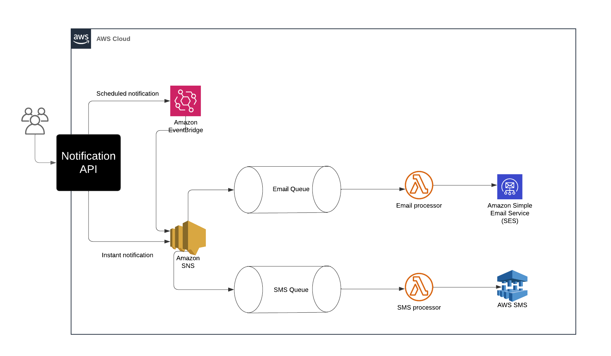

## Notification Service API

The Notification Service API is a microservice designed to send scheduled and instant notifications via email and SMS. It leverages AWS services like EventBridge, SNS, SQS, and Lambda to handle notifications efficiently.

### Architecture Overview

The architecture is built on AWS Cloud infrastructure and includes the following components:

    - Notification API: Built with Spring Boot, this API acts as the entry point for creating and managing notifications.
    - Amazon EventBridge: Used for scheduling notifications.
    - Amazon SNS (Simple Notification Service): Handles the distribution of instant notifications.
    - SQS Queues (Email Queue & SMS Queue): Queues for managing and processing email and SMS notifications asynchronously.
    - AWS Lambda Processors:
        - Email Processor: Retrieves messages from the Email Queue and sends them using Amazon SES.
        - SMS Processor: Retrieves messages from the SMS Queue and sends them using AWS SMS services.

### Architecture Diagram

Below is the architecture diagram illustrating the flow of notifications through the system:


### Features

    - Instant Notifications: Allows real-time notifications through SMS or email.
    - Scheduled Notifications: Uses AWS EventBridge to send notifications at specified times.
    - Email and SMS Processing: Utilizes Lambda functions to process and send queued notifications, enabling asynchronous handling and reliability.
    - AWS Integration: Efficient handling of notifications using managed AWS services for scalability and resilience.

### Technologies

    - Java & Spring Boot: REST API development.
    - AWS: SNS, SQS, EventBridge, Lambda, SES, SMS.
    - Queue-Based Processing: Asynchronous processing using SQS queues and Lambda functions.

### Setup and Installation

#### Prerequisites

    - Java 17+
    - Maven or Gradle (for building the project)
    - AWS account with permissions to use SNS, SQS, EventBridge, SES, and Lambda.

#### Steps

##### Clone the repository:

```bash
git clone https://github.com/yourusername/notification-service-api.git
cd notification-service-api
```

Configure AWS Credentials: Set up your AWS credentials locally. This can be done by configuring the AWS CLI or setting environment variables for AWS access keys.

##### Build the Project:

```bash
./mvnw clean install
```

##### Run the Application:

```bash
    ./mvnw spring-boot:Run
```

Configure AWS Resources: Ensure SNS, SQS queues, and Lambda functions are configured according to the architecture. You may use an Infrastructure-as-Code tool like Terraform or AWS CloudFormation to automate this setup.

Usage

    - Instant Notification: Create a notification with "type": "instant", which triggers an SNS message immediately.
    - Scheduled Notification: Set "type": "scheduled" with a scheduleTime to queue the notification for future processing via EventBridge.
